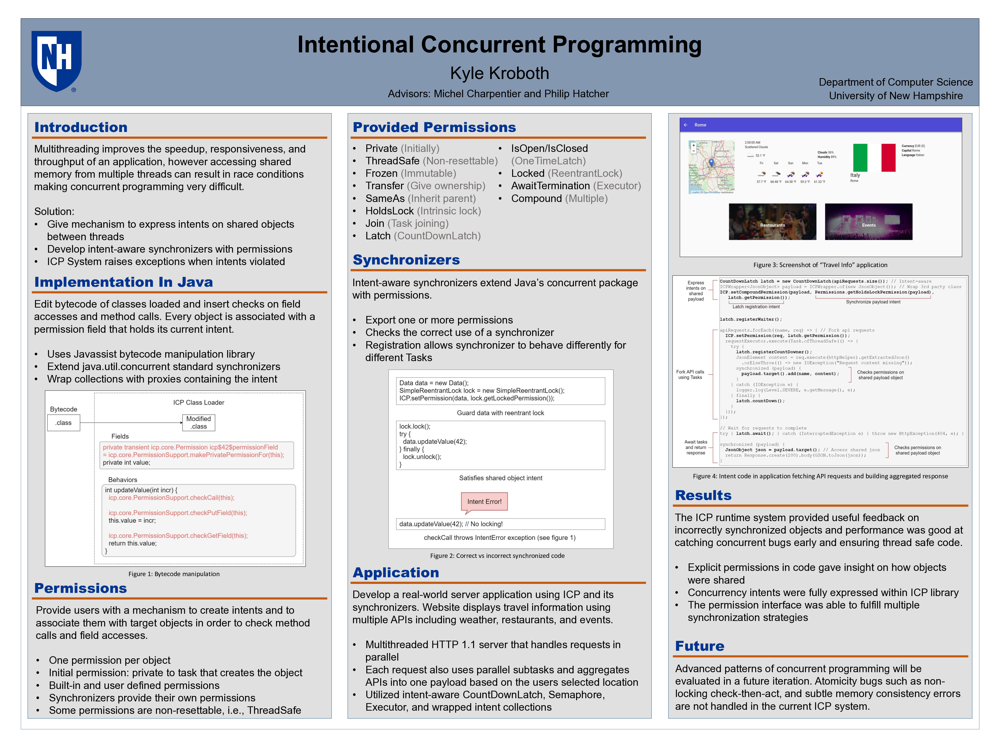

# Running tests with sbt

## Tests as main programs

```
[ICP] sbt
[info] ...
> test:runMain Main
[info] Running Main 
...
```

Note that `sbt 'test:runMain Main'` also works but gives you a nasty warning (they're working on it).

## TestNG tests

From the `sbt` shell, one can also run TestNG tests:

```
> test
...
[info] Passed: Total 33, Failed 0, Errors 0, Passed 33
[success] Total time: 53 s, completed Jun 26, 2017 11:31:17 AM
```

The tests to run are specified in the file `resources/testng.yaml`.  There are also commands to run specific TestNG tests/suites only, but I have not tried them.

# URC

